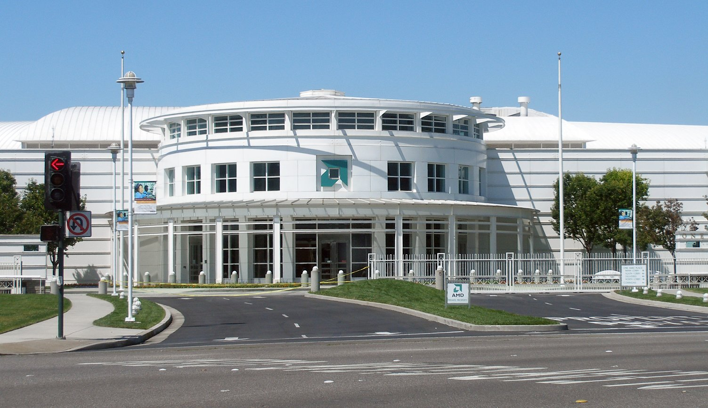

# Introducción

## Sobre AMD

\small

\columnsbegin
\column{0.5\textwidth}

* Fundada por Jerry Sanders en 1969
* Microcódigos: Acuerdo con Intel hasta 486

\column{0.5\textwidth}

* Establecida en Sunnyvale, CA
* Diseñó x86-64 en 2000 (K8 series)
* Compra ATI en 2006

\columnsend

# Bulldozer

## Bulldozer

* Lanzada en octubre de 2011
* Predecesor: K10
* 32 nm
* Soporte para AVX: AES, SSE4.1, SSE4.2; instrucciones SSE5 compatibles con AVX (XOP, FMA4, F16C)
* DRAM: Soporte sólo para DDR3
* Para servidores: Opteron 4200 y 6200 series

## Clustered Multithreading

\columnsbegin
\column{0.5\textwidth}

* Alternativa a SMT (*Hyperthreading*)
* Diseñado por DEC en 1996 (Alpha 21264)
* En Bulldozer: equivalente a 2 cores para enteros/1 core SMT para coma flotante
* Desventaja: 1 hebra sola desaprovecha unidades de ejecución

\column{0.5\textwidth}
\includegraphics[width=\textwidth]{bulldozer_cpu.PNG}
\columnsend

## Módulo vs. core

\columnsbegin
\column{0.5\textwidth}
\includegraphics[width=\textwidth]{bulldozer_8.jpg}

\centering
4 módulos = ¿8 cores?
\column{0.5\textwidth}
\includegraphics[width=\textwidth]{bulldozer_module.jpg}

\centering
Arquitectura de un módulo
\columnsend

\centering\scriptsize
`http://arstechnica.com/gadgets/2015/11/amd-sued-over-allegedly-misleading-bulldozer-core-count/`

Imágenes de *The Register*

## Rendimiento

* Rendimiento menor de lo esperado en Linux
* Resultados de benchmarks heterogéneos (FX-8150)
* Poco eficiente bajo carga

\centering\scriptsize
`https://www.phoronix.com/scan.php?page=article&item=amd_fx8150_bulldozer&num=1`

# Piledriver

## Piledriver

* Segunda generación de Bulldozer, 2ª mitad de 2012
* Mejoras generales frente a Bulldozer
	* Añade soporte para FMA3, BMI1 y TBM
	* Video Coding Engine $\rightarrow$ APUs
	* Mejora planificación de instrucciones y CMT
	* Más eficiente
	* Mejoras en precarga y predicción de rama (perceptrón)
* Procesadores con frecuencias hasta 5 GHz (Turbo)
* En servidores: Opteron 3200, 4200, 6200 series (hasta 16 cores, 4 CPU)

\centering\scriptsize
`http://www.anandtech.com/show/5831/amd-trinity-review-a10-4600m-a-new-hope`

# Siguientes generaciones

## Steamroller

* Enfocado a mayor paralelización
* Mejor planificación, predicción de rama
* Mayores cachés
* 28 nm

* No entran en procesadores de servidores de alta gama

\centering\scriptsize
`http://www.anandtech.com/show/6201/amd-details-its-3rd-gen-steamroller-architecture/`

## Excavator

* Última iteración de Bulldozer
* Reducción del area
* *Adaptive Voltage-Frequency Scaling* $\rightarrow$ optimización del rendimiento/vatio
* Centrada en APUs, no hay procesadores de escritorio de alta gama
* No entran en procesadores de servidores de alta gama

\centering\scriptsize
`https://www.techpowerup.com/210128/amds-excavator-core-is-leaner-faster-greener`
